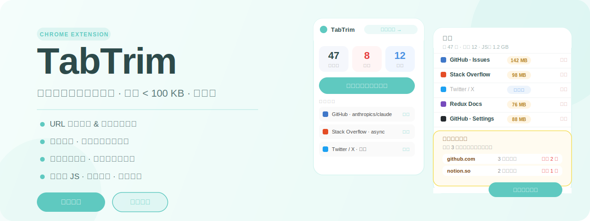
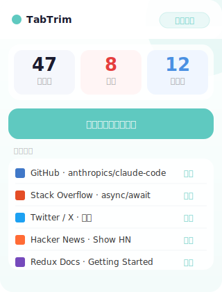
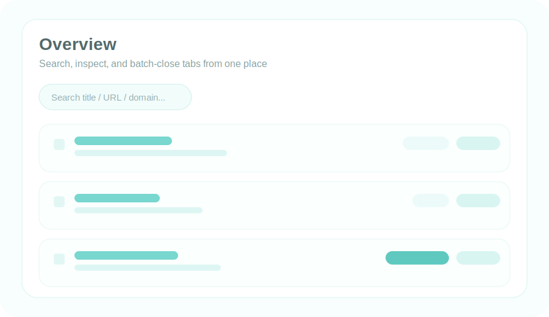
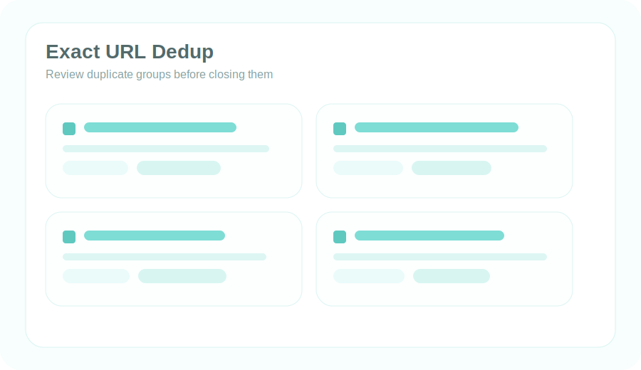
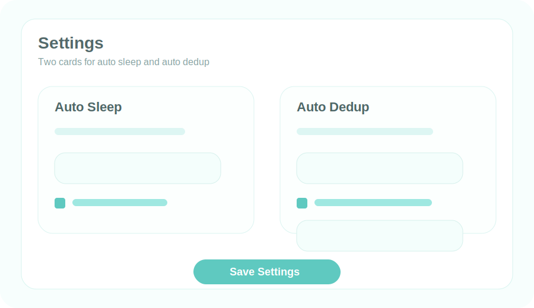

# TabTrim — 让你的标签页回归清爽

<p align="center">
  
</p>

<p align="center">
  
  
  
  
  
</p>

---

## 浏览器懒人必备 — 专治「舍不得关标签页」

你是不是也这样：

- 📌 **囤积强迫症**：「这个页面以后可能用得上」，然后再也没打开过
- 🔁 **重复开了一堆**：同一个 GitHub / 文档页面开了好几个，不知道哪个是最新的
- 🐌 **电脑越来越卡**：几十个标签页常驻，内存飙升，风扇狂转
- 😱 **手滑关错了**：刚关掉一个重要页面，历史记录里怎么也找不回来

**TabTrim 就是为这种使用习惯量身打造的。** 不用改变你「不爱关标签」的习惯，它在后台帮你自动整理、释放内存、保留历史——让你的浏览器始终保持流畅，想找的页面随时都在。

体积不到 100 KB，安装即用，无需任何配置。

---

## 🚀 核心功能一览

### 🔍 URL 精准去重
完全相同的 URL 才算重复，展开分组预览后再决定是否关闭，绝不误删。

### 🌐 主站域名去重（独家）
`github.com`、`github.com/user/repo`、`github.com/issues` 都算同一个主站。  
一键保留最近访问的那个，其余全部清理。

### 💤 自动休眠 + 内存监控
- 超过自定义时长未访问的标签页自动休眠（`chrome.tabs.discard`，真正释放内存）
- 每个标签页实时显示 JS 堆内存占用
- 概览页顶部显示所有标签页的总内存
- 去重操作后 Toast 提示释放了多少内存

### 🕐 关闭历史 & 一键恢复
最近 100 条关闭记录，支持搜索，点击即可恢复。再也不怕手滑关错页面。

### ⚡ 双入口操作
- **Popup 弹窗**：点击工具栏图标，秒看统计，快速去重
- **完整管理页**：概览 / 休眠管理 / 关闭历史 / 设置，深度管理

### 🤖 自动定时去重
设置间隔（1分钟 ～ 1天），后台自动清理完全重复的标签页，无需手动操作。

---

## 🖼 界面预览

<table>
  <tr>
    <td align="center" width="33%">
      <br>
      <b>Popup 快速操作</b>
    </td>
    <td align="center" width="67%">
      <br>
      <b>完整管理页 — 概览 + 内存监控</b>
    </td>
  </tr>
  <tr>
    <td align="center">
      <br>
      <b>主站域名去重</b>
    </td>
    <td align="center">
      <br>
      <b>设置 — 自动休眠 & 自动去重</b>
    </td>
  </tr>
</table>

---

## 💡 为什么只有 < 100 KB？

TabTrim 刻意保持极简：
- **零框架**：不依赖 React / Vue / jQuery，纯原生 HTML + CSS + JS
- **无构建**：没有 webpack / vite / node_modules，整个项目就是几个文件
- **按需加载**：Popup 和管理页完全独立，互不影响
- **SVG 图标**：程序生成，不引入任何图片资源

> 对比市面上动辄 2-10 MB 的标签管理插件，TabTrim 的体积不到它们的 1/20。

---

## 📦 安装步骤（无需构建，5步完成）

**第一步：下载项目**

```bash
git clone https://github.com/your-username/chrome-tab-manager.git
```

或点击页面右上角 `Code → Download ZIP`，解压到本地任意目录。

**第二步：打开 Chrome 扩展管理页**

在 Chrome 地址栏输入并回车：

```
chrome://extensions/
```

**第三步：开启开发者模式**

页面右上角找到 `Developer mode`（开发者模式）开关，点击打开。  
开启后页面顶部会出现三个新按钮。

**第四步：加载扩展**

点击 `Load unpacked`（加载已解压的扩展程序），在弹出的文件选择框中，  
选择刚才下载/解压的项目文件夹（即包含 `manifest.json` 的那个目录）。

**第五步：固定到工具栏（推荐）**

点击 Chrome 工具栏右侧的拼图图标 🧩，找到 `TabTrim`，点击图钉图标将其固定。  
之后点击工具栏中的 TabTrim 图标即可快速使用。

---

## 📖 使用说明

### A. 快速去重（Popup）

1. 点击工具栏中的 **TabTrim 图标**
2. 查看顶部统计：总标签数 / 重复数 / 休眠数
3. 点击 **「一键关闭重复标签页」** 完成 URL 精准去重
4. 下方显示最近 5 条关闭记录，点击可直接恢复

### B. URL 精准去重（管理页）

1. 点击 Popup 中的 **「完整管理」** 进入管理页
2. 停留在 **「概览」** 标签页
3. 点击 **「URL 去重」** 按钮
4. 页面展开分组面板，查看每组重复的标签页详情
5. 勾选需要清理的 URL 分组（默认全选）
6. 点击 **「关闭所选 URL 组」** 完成清理，Toast 显示释放内存量

### C. 主站域名去重（管理页）

1. 进入管理页，停留在 **「概览」** 标签页
2. 点击 **「主站域名去重」** 按钮
3. 展开面板，查看每个主站下的所有标签页
4. 勾选需要清理的域名组
5. 点击 **「关闭所选主站」**，每组保留最近访问的一个

### D. 查看内存占用

1. 进入管理页 **「概览」** 标签页
2. 顶部统计栏显示所有标签页的 **总 JS 堆内存**
3. 每个标签行右侧显示该标签页的 **单独内存占用**（橙色标签）
4. 执行去重操作后，Toast 提示本次释放的内存量

### E. 管理休眠标签页

1. 进入管理页，点击 **「休眠管理」** 标签页
2. 查看所有休眠中的标签页列表
3. 点击标题可直接跳转激活该标签页
4. 点击 **「唤醒」** 恢复单个标签页，或点击 **「全部唤醒」**

### F. 恢复关闭的标签页

1. 进入管理页，点击 **「关闭历史」** 标签页
2. 在搜索框输入标题或 URL 关键词快速定位
3. 点击目标记录右侧的 **「恢复」** 按钮，标签页立即重新打开

### G. 配置自动休眠 & 自动去重

1. 进入管理页，点击 **「设置」** 标签页
2. **左侧卡片**：设置自动休眠阈值（分钟），开启/关闭自动休眠
3. **右侧卡片**：开启自动去重，选择执行间隔（1分钟 ～ 1天）
4. 点击 **「保存设置」**，设置立即生效

---

## 🗂 项目结构

```
chrome-tab-manager/
├── manifest.json              # MV3 配置
├── background/
│   └── service-worker.js      # 核心逻辑：休眠、去重、历史、内存
├── content/
│   └── memory.js              # 内存采集 content script
├── popup/
│   ├── popup.html
│   ├── popup.css
│   └── popup.js
├── manager/
│   ├── manager.html
│   ├── manager.css
│   └── manager.js
└── icons/
    └── icon.png
```

---

## 🔐 权限说明

| 权限 | 用途 |
|------|------|
| `tabs` | 读取和操作标签页 |
| `storage` | 保存设置、活动记录、关闭历史 |
| `alarms` | 定时执行休眠检查和自动去重 |
| `tabGroups` | 支持 Chrome 原生标签分组 |
| `scripting` | 注入 content script 采集内存数据 |

> TabTrim **不收集任何用户数据**，所有数据仅存储在本地 `chrome.storage.local`。

---

## 📋 注意事项

- 基于 **Chrome Extension Manifest V3**，仅支持 Chrome / Chromium 系浏览器
- 内存数据来源于 `performance.memory`（Chrome 专有 API），显示的是 JS 堆内存，非进程总内存
- 「已记录时长」由扩展自身追踪，首次安装前打开的标签页从安装时开始计时
- 主站域名去重支持常见多级后缀（如 `co.uk`、`com.cn` 等）

---

## 📄 License

MIT © 2026
